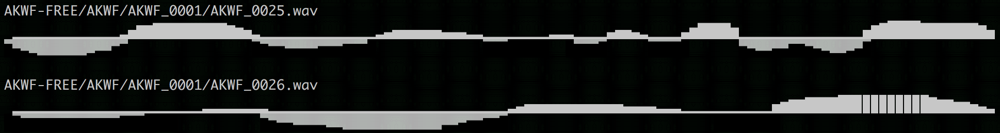

# audio-cat
show a waveform on the console for a given audio file

## Installation

You'll need Rust, libsndfile.

```
cargo build
cargo install
```

## Demo

```
$ audio-cat AKWF-FREE/AKWF/AKWF_0001/AKWF_0025.wav && \
  audio-cat AKWF-FREE/AKWF/AKWF_0001/AKWF_0026.wav
```


